# Gender Detection

El objetivo de este proyecto será crear una red neuronal capaz de identificar el género de una persona.

Se utilizarán los siguientes datasets

* [dataset1](https://www.kaggle.com/datasets/vishesh1412/celebrity-face-image-dataset)
* [dataset2](https://www.kaggle.com/datasets/ashwingupta3012/male-and-female-faces-dataset)
* [dataset3](https://www.kaggle.com/datasets/trainingdatapro/gender-detection-and-classification-image-dataset)
* [dataset4](https://www.kaggle.com/datasets/snmahsa/human-images-dataset-men-and-women)

La arquitectura a utilizar en la red será una **fully-connected network tipo MLP**. Se utilizará `ReLu` como función de activación en las *hidden layers* y `Sigmoid` en la neurona del *output layer*, ya que es un problema de clasificación binaria.

La cantidad de neuronas, capas y épocas se irá definiendo a medida que probemos el ejercicio, ya que aún no conocemos técnicas de selección de hiperparámetros dentro de Keras.


## Preprocesamiento

El primer paso del ejercicio fue transformar las imágenes a una representación vectorial para poder ser consumidas por la red.

Para ello utilizamos las siguientes funciones:

```
import cv2
from os import listdir
from numpy.__config__ import show
from .resize_image import resize_image
import numpy as np
from .show_image import show_image

def resize_image(image, dimensions):
    image = cv2.resize(image, dimensions, interpolation=cv2.INTER_AREA)
    return image

def convert_images(folder_path, dimensions):
    X_data = []
    Y_data = []
    for gender in ["male", "female"]:
        for img in listdir(folder_path+gender):
            path = f'{folder_path}/{gender}/{img}'
            print(path)
            imagen = cv2.imread(path, cv2.IMREAD_COLOR)
            imagen_rgb = cv2.cvtColor(imagen, cv2.COLOR_BGR2RGB)
            imagen_rgb = resize_image(imagen_rgb, dimensions)
            vector = imagen_rgb.flatten().astype("float32") / 255
            target = 1 if gender=="male" else 0
            X_data.append(vector)
            Y_data.append(target)
    return [np.array(X_data), np.array(Y_data)]
```

Se cargan las imagenes, se ajustan todas a las mismas dimensiones, se aplanan y por ultimo se normalizan los valores.

Luego se cargan los datos de la siguiente manera:


```
import numpy as np
from sklearn.model_selection import train_test_split
import pandas as pd

data_folder = "./converted_data/"
dimensions = (160,160)

[X_data, Y_data] = [np.load(f"{data_folder}/x_data.npy"), np.load(f"{data_folder}/y_data.npy")]
X_train, X_val, Y_train, Y_val = train_test_split(X_data, Y_data, test_size=0.3, stratify=Y_data, random_state=42)
X_test, X_val, Y_test, Y_val = train_test_split(X_val, Y_val, test_size=0.5, stratify=Y_val, random_state=42)
```


## Entrenamiento/Evaluacion

### Test 1

Luego, en el proceso de entrenamiento, empezamos con la siguiente arquitectura:


```
net = models.Sequential()
net.add(layers.Dense(300, activation="relu", input_shape=(dimensions[0]*dimensions[1]*3,)))
net.add(layers.Dense(200, activation="relu"))
net.add(layers.Dense(100, activation="relu"))
net.add(layers.Dense(50, activation="relu"))
net.add(layers.Dense(20, activation="relu"))
net.add(layers.Dense(10, activation="relu"))
net.add(layers.Dense(1, activation="sigmoid"))

net.compile(loss="binary_crossentropy", optimizer="sgd", metrics=["precision", "recall"])
history = net.fit(
    X_train,
    Y_train,
    epochs=20,
    validation_data=[X_val, Y_val]
)
```

Obtuvimos los siguientes resultados:

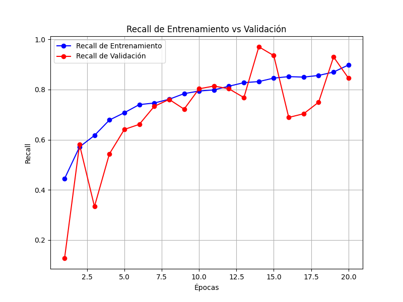
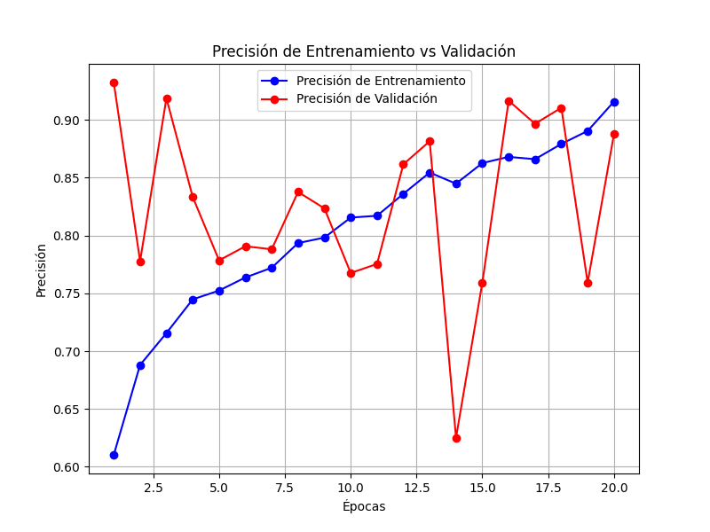

### Test 2

En el segundo test, probamos con la siguiente configuracion

```
net = models.Sequential()
net.add(layers.Dense(300, activation="relu", input_shape=(dimensions[0]*dimensions[1]*3,)))
net.add(layers.Dense(100, activation="relu"))
net.add(layers.Dense(50, activation="relu"))
net.add(layers.Dense(1, activation="sigmoid"))

net.compile(loss="binary_crossentropy", optimizer="adam", metrics=["precision", "recall"])
history = net.fit(
    X_train,
    Y_train,
    epochs=20,
    validation_data=[X_val, Y_val]
)
```

Reduciendo la cantidad de neuronas y capas y cambiando a la funcion de optimizacion `adam`

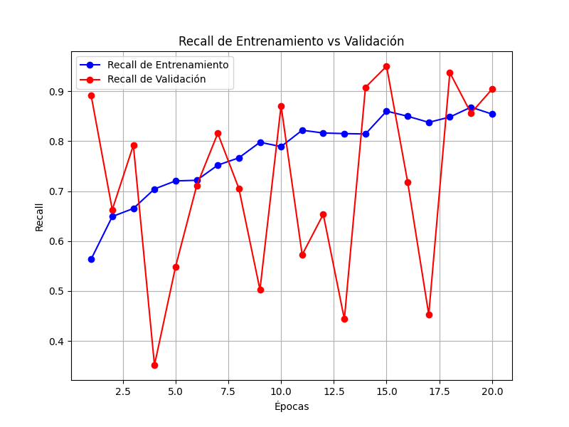
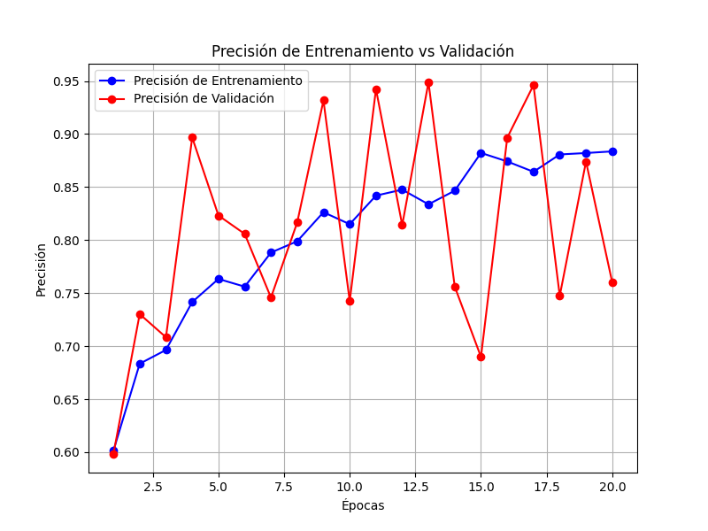

### Test 3

Utilizando la siguiente configuracion:

```
net = models.Sequential()
net.add(layers.Dense(1000, activation="relu", input_shape=(dimensions[0]*dimensions[1]*3,)))
net.add(layers.Dense(700, activation="relu"))
net.add(layers.Dense(500, activation="relu"))
net.add(layers.Dense(300, activation="relu"))
net.add(layers.Dense(200, activation="relu"))
net.add(layers.Dense(100, activation="relu"))
net.add(layers.Dense(50, activation="relu"))
net.add(layers.Dense(10, activation="relu"))
net.add(layers.Dense(1, activation="sigmoid"))

net.compile(loss="binary_crossentropy", optimizer="adam", metrics=["precision", "recall"])
history = net.fit(
    X_train,
    Y_train,
    epochs=25,
    validation_data=[X_val, Y_val]
)

```

Aumentando capas, neuronas y epocas, obtuvimos los siguientes resultados.

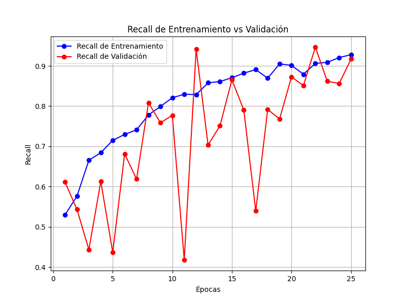
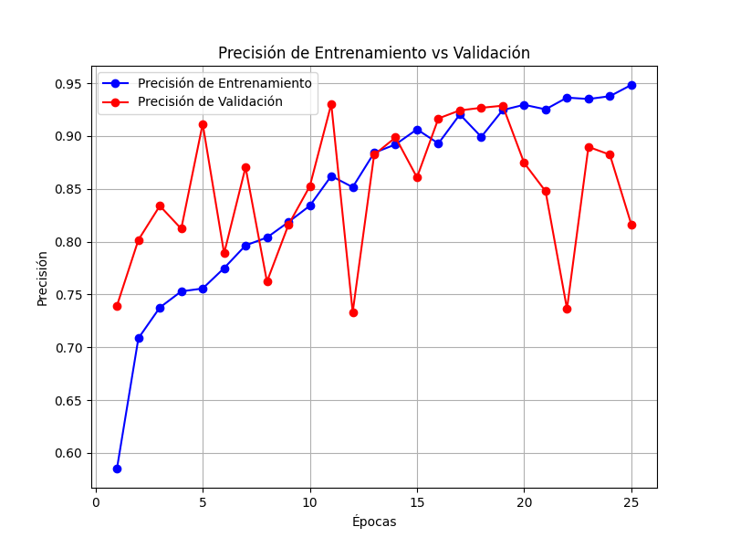


Luego, decidimos invertir algo de tiempo en aumentar la cantidad de imagenes a utilizar. Ahora contamos con ~9000.

### Test 4

Decidi probar con la misma configuracion del primer test para comparar resultados:

```

net = models.Sequential()
net.add(layers.Dense(300, activation="relu", input_shape=(dimensions[0]*dimensions[1]*3,)))
net.add(layers.Dense(200, activation="relu"))
net.add(layers.Dense(100, activation="relu"))
net.add(layers.Dense(50, activation="relu"))
net.add(layers.Dense(20, activation="relu"))
net.add(layers.Dense(10, activation="relu"))
net.add(layers.Dense(1, activation="sigmoid"))

net.compile(loss="binary_crossentropy", optimizer="sgd", metrics=["precision", "recall"])
history = net.fit(
    X_train,
    Y_train,
    epochs=20,
    validation_data=[X_val, Y_val]
)
```

Luego, encontramos los siguientes resultados

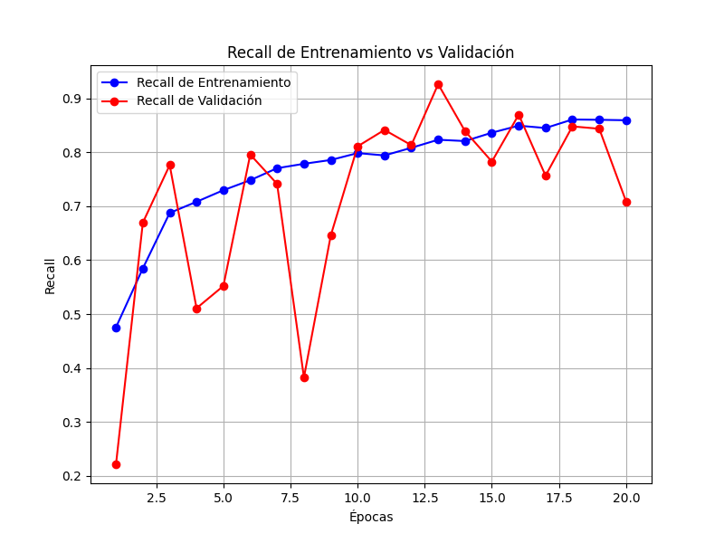
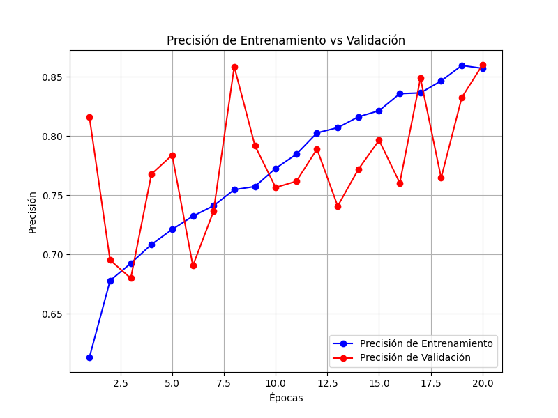

### Test 5

Intentamos nuevamente con la primera configuracion pero esta vez utilizando las imagenes con escala de grises, obtuvimos los siguientes resultados:


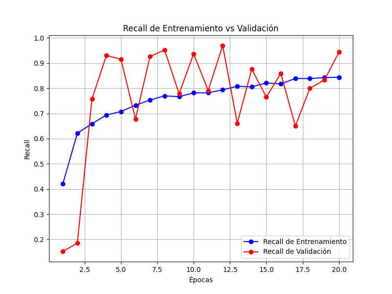
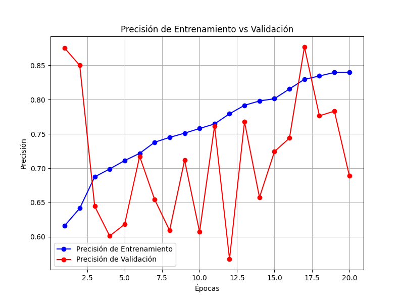


Bastante peores.


### Test 6

Probando de nuevo la primera arquitectura, aumentamos la cantidad de ejemplos en el conjunto de validacion, alcanzamos los siguientes resultados:


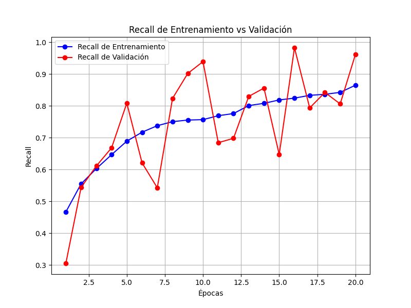
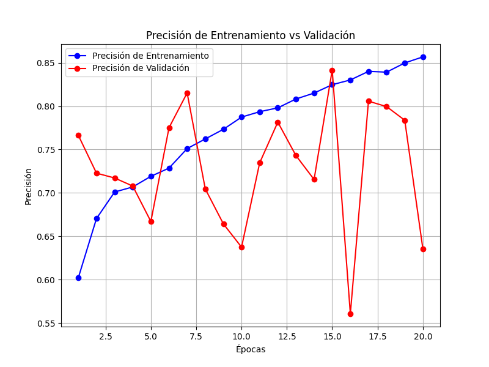


### Test 7

Luego, para descartar, quise probar tecnicas de regularizacion:

```
net = models.Sequential()
net.add(layers.Dense(300, kernel_regularizer=l2(0.001),  activation="relu", input_shape=(dimensions[0]*dimensions[1]*3,)))
net.add(layers.Dense(200, kernel_regularizer=l2(0.001), activation="relu"))
net.add(layers.Dense(100, kernel_regularizer=l2(0.001), activation="relu"))
net.add(layers.Dense(50, kernel_regularizer=l2(0.001), activation="relu"))
net.add(layers.Dense(20, kernel_regularizer=l2(0.001), activation="relu"))
net.add(layers.Dense(10, kernel_regularizer=l2(0.001), activation="relu"))
net.add(layers.Dense(1, activation="sigmoid"))

net.compile(loss="binary_crossentropy", optimizer="sgd", metrics=["precision", "recall"])
history = net.fit(
    X_train,
    Y_train,
    epochs=20,
    validation_data=[X_val, Y_val]
)

```

Obteniendo resultados no muy diferentes:


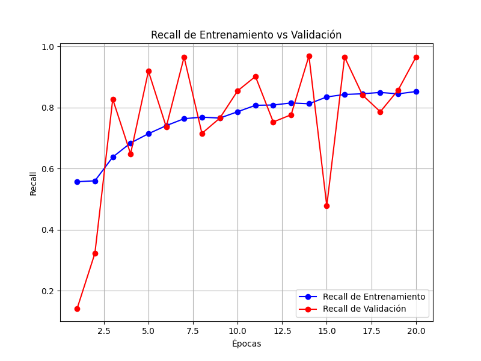
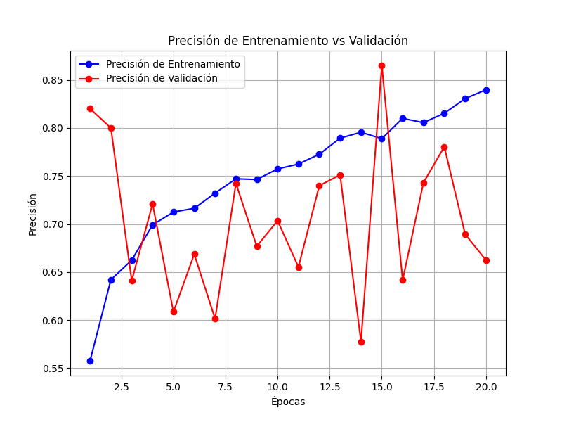


Las ideas que se me ocurren para mejorar el rendmiento de la red son las siguientes:

* Aumentar la cantidad de ejemplos, en un 300% por lo menos.
* Implementar tecnicas de seleccion inteligente de capas y neuronas.
* De igual manera, implementar tecnicas de seleccion de hiperparámetros para la decision de la funcion de activacion en las *hidden layers*, lo mismo para la funcion de optimizacion.


No tenemos ni los conocimientos ni el poder computacional para hacer lo anterior, pero lo tendremos en el futuro, y volveremos a este proyecto.

### Test 8


Despues de algunos dias, aprendimos que las fluctuaciones de rendimiento que percibimos estan muy relacionadas con el learning rate, utilizando el siguiente codigo percibimos algunas mejorias:

```
net = models.Sequential()
net.add(layers.Dense(500,  activation="relu", input_shape=(dimensions[0]*dimensions[1]*3,)))
net.add(layers.Dense(300, activation="relu"))
net.add(layers.Dense(200, activation="relu"))
net.add(layers.Dense(100, activation="relu"))
net.add(layers.Dense(50, activation="relu"))
net.add(layers.Dense(20, activation="relu"))
net.add(layers.Dense(1, activation="sigmoid"))

net.compile(loss="binary_crossentropy", optimizer=optimizers.SGD(learning_rate=0.0001), metrics=["precision", "recall"])
history = net.fit(
    X_train,
    Y_train,
    epochs=30,
    validation_data=[X_val, Y_val]
)
```

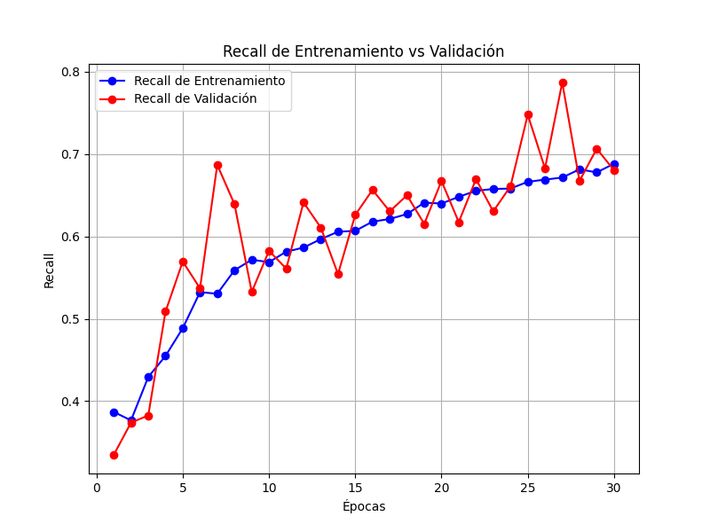
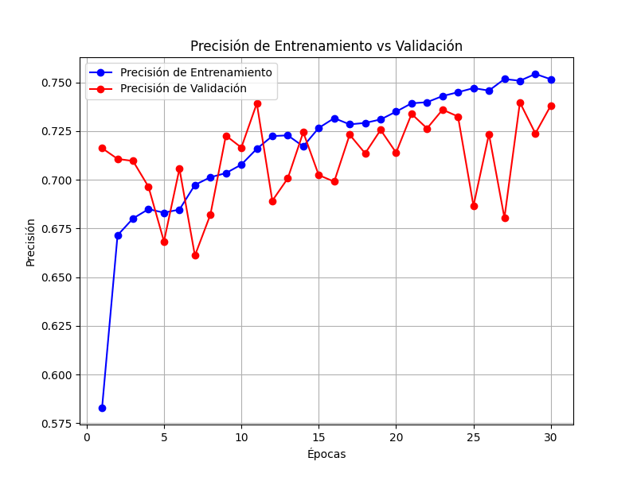


